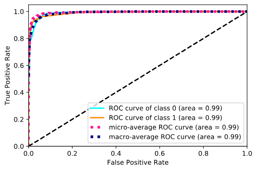

# cnn_face_recogntion

A project of face recogntion used Convolution Nerual Network (CNN)

## Data

We have 1000 images. We use 600 images as training data. The rest is in validation data. 

In training data, we crop labeled face images as positive instances. We generate negative instances by cutting out the images located outside the face zone. All these positve and negative instances build up the training set.

We do the same thing for the validation set.

(More details in the the notebook **[data_preparation](./notebook/data_preparation.ipynb)**)

## Modeling

We first load the training and validation data. Then, we create the labels. For the face images, we put them in *class 1*. The rest is in *class 0*. And, we do the one-hot coding for the labels.

The model we created is inspired by a state-of-art model, VGG16. There are some tricks to improve the model.

* **To improve the performance**: You can add more blocks or more convolutional layers in each block. Because convolutional layer can capture the features of images, such as borders, corners, etc.

* **To improve the speed of the training**: You can reduce the number of nerons in each layer, especially, these in the *fully connected(fc)* layer. But, the improvement of the training speed may have negative effect in the performance of the model.

(More details in the notebook **[modeling](./notebook/modeling.ipynb)**)

## Evaluation of Model

Our model's accuracy is about **96%** on both training set and validation set. 

In this part, we will present the different types of ROC curve and calculate AUC (Area Under Cuvre) to evalue our model on the validation set.

(More details in the notebook **[evaluation](./notebook/evaluation.ipynb)**)

## Visualization of Model
To understand how our model makes the classification decision, we try to visualize our model.

According to the paper [Grad-CAM: Visual Explanations from Deep Networks via Gradient-based Localization](https://arxiv.org/abs/1610.02391), we create an implementation of the algorithme **Guided Grad-CAM**.